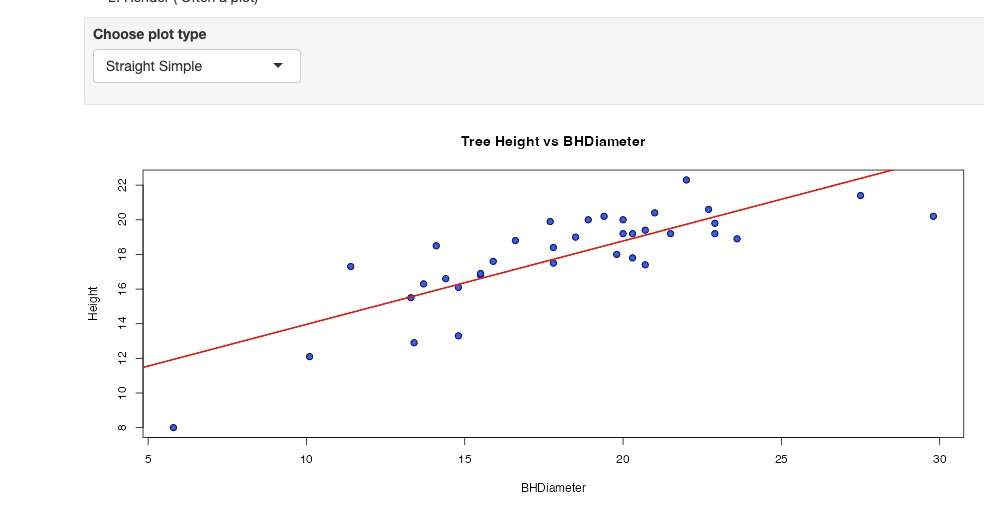
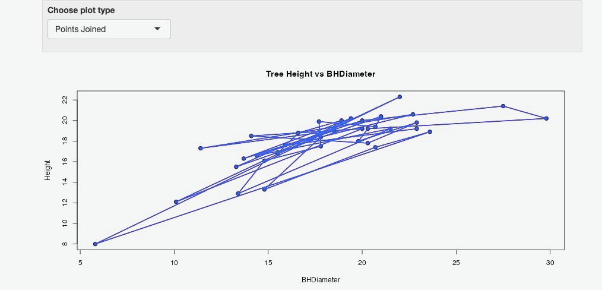
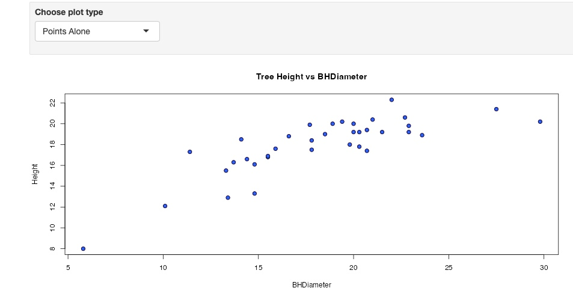

```{r setup, include=FALSE}
knitr::opts_chunk$set(echo = TRUE)
```

#Tasks

## Task 1


```{r}
getwd()
```

## Task 2

```{r}
spruce.df = read.csv("SPRUCE.csv")
head(spruce.df)
```

## Task 3

```{r}
plot(Height~BHDiameter, data = spruce.df, main = "Tree Height vs BHDiameter", xlab = "BHDiameter (cm)", ylab = "Height (m)", pch = 21, bg = "blue", cex = 1.2,
     xlim = c(0, max(BHDiameter) * 1.1), ylim = c(0, max(Height) * 1.1))

print("There does appear to be a straight line relationship based on the height and diameters.")
```

### f = 0.7

```{r}
print("f = 0.7")
obj = lm(Height~BHDiameter, data = spruce.df)
summary(obj)
plot(Height~BHDiameter, data = spruce.df)
abline(obj)
library(s20x)
trendscatter(Height~BHDiameter,f=0.7, data=spruce.df)
```

### f = 0.6

```{r}
print("f = 0.6")
obj = lm(Height~BHDiameter, data = spruce.df)
summary(obj)
plot(Height~BHDiameter, data = spruce.df)
abline(obj)
library(s20x)
trendscatter(Height~BHDiameter,f=0.6, data=spruce.df)
```

### f = 0.5

```{r}
print("f = 0.5")
obj = lm(Height~BHDiameter, data = spruce.df)
summary(obj)
plot(Height~BHDiameter, data = spruce.df)
abline(obj)
library(s20x)
trendscatter(Height~BHDiameter,f=0.5, data=spruce.df)

print("The straight line can still be seen but the smooth curve does provide a better idea of the trend seen in the graphs.")
```

## Task 4

```{r}

layoutShow4 = layout(matrix(1:4, nr = 2, nc = 2, byrow = TRUE))


with(spruce.df, plot(BHDiameter, Height, main = "Tree Height vs BHDiameter", xlab = "BHDiameter (cm)", ylab = "Height (m)", pch = 21, bg = "blue", cex = 1.2,
     xlim = c(0, max(BHDiameter) * 1.1), ylim = c(0, max(Height) * 1.1)))
abline(obj)
yhat = predict(obj)

with(spruce.df, plot(BHDiameter, Height, main = "Tree Height vs BHDiameter", xlab = "BHDiameter (cm)", ylab = "Height (m)", pch = 21, bg = "blue", cex = 1.2,
     xlim = c(0, max(BHDiameter) * 1.1), ylim = c(0, max(Height) * 1.1)))
with(spruce.df, {segments(BHDiameter, Height, BHDiameter, yhat, col = "green")})
abline(obj)

with(spruce.df, plot(BHDiameter, Height, main = "Tree Height vs BHDiameter Mean", xlab = "BHDiameter (cm)", ylab = "Height (m)", pch = 21, bg = "blue", cex = 1.2,
     xlim = c(0, max(BHDiameter) * 1.1), ylim = c(0, max(Height) * 1.1)))
with(spruce.df, abline(h = mean(Height)))
with(spruce.df, segments(BHDiameter, mean(Height), BHDiameter, yhat, col = "red"))
abline(obj)

with(spruce.df, plot(BHDiameter, Height, main = "Tree Height vs BHDiameter Mean", xlab = "BHDiameter (cm)", ylab = "Height (m)", pch = 21, bg = "blue", cex = 1.2,
     xlim = c(0, max(BHDiameter) * 1.1), ylim = c(0, max(Height) * 1.1)))
with(spruce.df, abline(h = mean(Height)))
with(spruce.df, segments(BHDiameter, Height, BHDiameter, mean(Height), col = "blue"))


yhat = predict(obj)
y = spruce.df$Height
ymean = mean(y)
TSS = sum((y - ymean)^2)
RSS = sum((y - yhat)^2)
MSS = TSS - RSS
cat("TSS = ", TSS, "\n")
cat("RSS = ", RSS, "\n")
cat("MSS = ", MSS, "\n")

MTSS = MSS/TSS
cat("MSS/RSS = ", MTSS, "\n")
cat("Based on this value, the straight line model wouldn't be the best option. The value given indicates that a little more than half of the variability in Height is covered by the graphs above. It's not perfect so a curved relationship can be better.")

TMSS = MSS + RSS
cat("TSS = ", TSS, " MSS + RSS = ", TMSS, " Yes \n")

```

## Task 5
```{r}
spruce.lm = with(spruce.df, lm(Height~BHDiameter))
summary(spruce.lm)

#Slope
coef(spruce.lm)[2]
spruce.lm$coefficients[2]

#Intercept
coef(spruce.lm)[1]

#Write equation for fitted line
cat("Equation for fitted line: Height = ", coef(spruce.lm)[1], " + ", coef(spruce.lm)[2], " * BHDiameter")

#Prediction based on BHDiameter = 15,18,20
predict(spruce.lm, data.frame(BHDiameter = c(15, 18, 20)))

```

## Task 6
```{r}
library(ggplot2)

ggplot(spruce.df, aes(x = BHDiameter, y = Height, color = BHDiameter)) + geom_point() + geom_line() + geom_smooth(method = "lm") + ggtitle("Height Vs Diameter")
```


## Task 7

<center>
{ width=70% }
</center>

<center>
{ width=70% }

</center>

<center>
{ width=70% }
</center>

