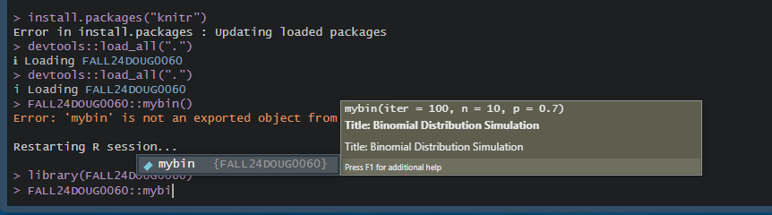

```{r setup, include=FALSE}
knitr::opts_chunk$set(echo = TRUE)
```

#Tasks

## Task 1


```{r}
getwd()
```

## Task 2

### 100 Iterations

```{r}
mybin=function(iter=100,n=10, p=0.7){ 
# This is the function that will simulate a binomial distribution
# The top portion is adjustable when the function is called
# iter is for the number of iterations, n is for the sample, and p is the probability
sam.mat=matrix(NA,nr=n,nc=iter, byrow=TRUE)
# This part creates a matrix to hold the samples
succ=c()
for( i in 1:iter){
# Using the empty vector the for loop goes through the iterations 
sam.mat[,i]=sample(c(1,0),n,replace=TRUE, prob=c(p,1-p))
succ[i]=sum(sam.mat[,i])
}
# Success is based on p while the failures are based on 1-p
# The successes are tracked and the following will create a table of the successes
succ.tab=table(factor(succ,levels=0:n))
barplot(succ.tab/(iter), col=rainbow(n+1), main="Binomial simulation", xlab="Number of successes")
# This will create a barplot of the proportions of the successes
succ.tab/iter
}
bin100 = mybin(iter=100,n=10, p=0.7)
```

### 200 Iterations

```{r}
mybin(iter=200,n=10, p=0.7)
```

### 500 Iterations

```{r}
mybin(iter=500,n=10, p=0.7)
```

### 1000 Iterations

```{r}
mybin(iter=1000,n=10, p=0.7)
```

### 10000 Iterations

```{r}
mybin(iter=10000,n=10, p=0.7)
```

### Verifying using dhyper()

```{r}
dbin.tab = round(dbinom(0:10, size = 10, prob = 0.7), 4)
names(dbin.tab) = 0:10
dbin.tab
```

## Task 3

### No replacement

```{r}
sample(c(1, 1, 1, 1, 1, 1, 1, 1, 1, 1, 1, 1, 0, 0, 0, 0, 0, 0, 0, 0), size = 5, replace = FALSE, prob = NULL)
```

### With Replacement

```{r}
sample(c(1, 1, 1, 1, 1, 1, 1, 1, 1, 1, 1, 1, 0, 0, 0, 0, 0, 0, 0, 0), size = 5, replace = TRUE, prob = NULL)
```

### Using function myhyper()

```{r}
myhyper = function(iter = 100, N = 20, r = 12, n = 5){
  
  sam.mat = matrix(NA, nrow = n, ncol = iter, byrow = TRUE)
  
  successes = c()
  
  for(i in 1:iter){
    
    sam.mat[, i] = sample(rep(c(1, 0), c(r, N - r)), n, replace = FALSE)
    
    successes[i] = sum(sam.mat[, i])
    
  }
  
  success.tab = table(factor(successes, levels = 0:n))
  
  iter.lab = paste0("iter = ", iter)
  N.lab = paste0("N = ", N)
  r.lab = paste0("r = ", r)
  n.lab = paste0("n = ", n)
  lab = paste(iter.lab, N.lab, r.lab, n.lab, sep = ", ")
  barplot(success.tab/(iter), col = rainbow(n + 1), main = "Hypergeometric Simulation", sub = lab, xlab = "Number of Successes")
  success.tab / iter
}
```

### 100 Iterations

```{r}
myhyper1 = myhyper(iter = 100, N = 20, r = 12, n = 5)
```

### 200 Iterations

```{r}
myhyper2 = myhyper(iter = 200, N = 20, r = 12, n = 5)
```

### 500 Iterations

```{r}
myhyper3 = myhyper(iter = 500, N = 20, r = 12, n = 5)
```

### 1000 Iterations

```{r}
myhyper4 = myhyper(iter = 1000, N = 20, r = 12, n = 5)
```

### 10000 Iterations

```{r}
myhyper5 = myhyper(iter = 10000, N = 20, r = 12, n = 5)
```

### Verifying using dhyper()

```{r}
dhyper.tab = round(dhyper(x = 0:5, m = 12, n = 8, k = 5), 4)
names(dhyper.tab) = 0:5
dhyper.tab
```

## Task 4
The code should be creating samples and uses factors to create barplots. It is something that could be implemented as a function for the package for use in part 6. 
Here is the following code to be reviewed:

```{r}
mysample=function(n, iter=10,time=0.5){
for( i in 1:iter){
#make a sample
s=sample(1:10,n,replace=TRUE)
# turn the sample into a factor
sf=factor(s,levels=1:10)
#make a barplot
barplot(table(sf)/n,beside=TRUE,col=rainbow(10), 
main=paste("Example sample()", " iteration ", i, " n= ", n,sep="") ,
ylim=c(0,0.2)
)

#release the table
Sys.sleep(time)
}
}
```

This creates barplots based on the sample data. At the start of each iteration, a sample is taken from the numbers 1 to 10. The sample is then turned into a factor and a barplot is created. The table is then released after a certain amount of time. These are basically pauses built in. 

### Running the Function

After running the function with iter = 30, there are small fluctuation in the barplots. If all of them were to be averaged out it should make bars with similar lengths. The following is one of the barplots.

```{r}
mysample(n = 1000, iter = 1, time = 1)
```

## Task 5

```{r}
choose(8, 4)
print("Result for choose(8, 4)")


1 - ppois(q = 3, lambda = 2)
print("Result for 1 - ppois(q = 3, lambda = 2)")


choose(10 - 1, 3 - 1) * 0.4^3 * (1 - 0.4)^(10 - 3)
print("Result for P(Y = 10), Y NegBin(p=0.4, r=3)")


pbinom(8, 15, 0.4)
print("Result for pbinom(8, 15, 0.4)")
```

## Task 6

Created an R function called mybin. It is setup with roxygen and a screenshot is included of the console of its setup. Here are a few outputs using different inputs.

```{r}

```


```{r}
FALL24DOUG0060::mybin(iter = 9, n = 3, p = 0.9)
FALL24DOUG0060::mybin(iter = 10, n = 5, p = 0.5)
FALL24DOUG0060::mybin(iter = 11, n = 7, p = 0.3)
```

## Task 7
Trying some stuff out:

```{r}
#trials needed to get required successes, need parameters target, probability of success for specific trial, and number of trials. Need to find mean,variance, 
```


